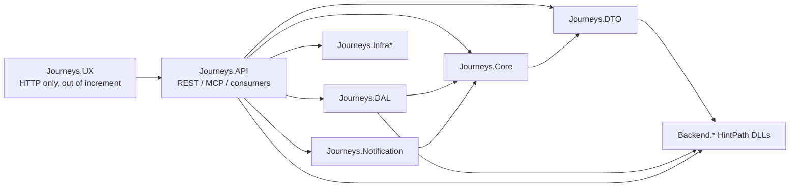
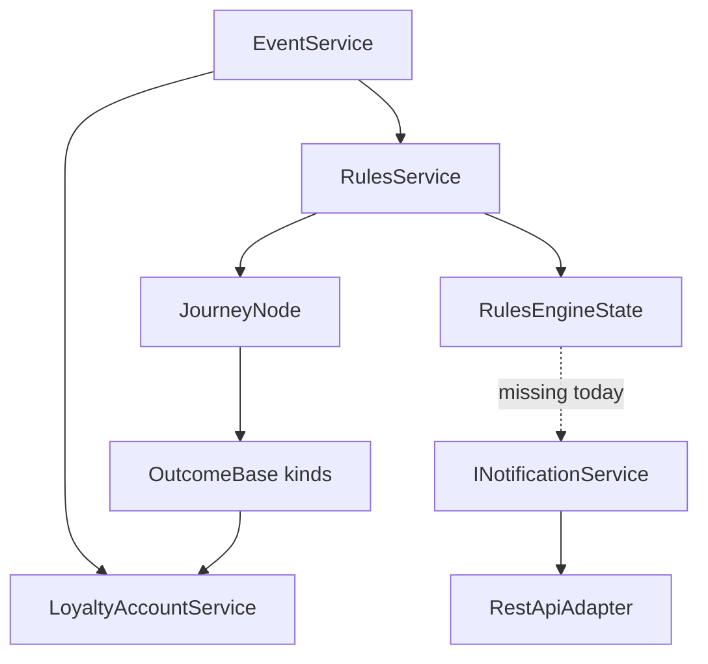
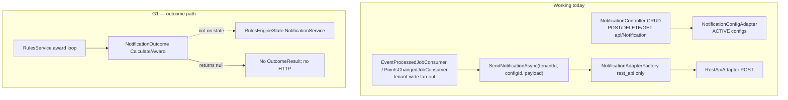
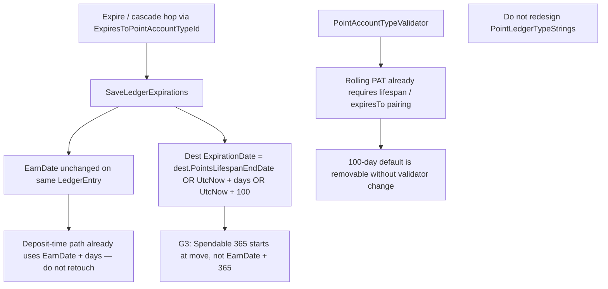

# Architecture

## Architecture Analysis

### System Overview

Journeys is a **modular monolith** on net8.0 onion layers. One deployable API hosts REST, MCP, and campaign-agent HTTP. Core owns all business rules. Persistence and Azure/`Backend.*` I/O live behind interfaces in adapter packages. `Journeys.UX` is an HTTP-only Next.js client and is **out of this increment**.

The process-event path is the spine of the stated MVP: inbound event → populate loyalty account → (intended) bring points current → hydrate journey rule state → navigate → evaluate RuleSets → calculate outcomes → award ledgers/tags/(intended) webhooks → persist wrapper state. Tenant isolation is mandatory on every business operation.

### Architectural Style

**Modular monolith + onion (hexagonal adapters), not microservices.** Evidence: `docs/platform/architecture.md`; project references DTO → Core → DAL / Infra* / Notification → API; controllers map HTTP and call services; `Journeys.Notification` is adapters only.

MassTransit is present (8.5.5) for job consumers. Process-event publish from `EventService` is **commented out** (lines ~966–997) and must stay commented this increment. That is not an event-driven core; the engine is synchronous inside `ProcessEventInternalAsync`.

### Component Relationships

Package-level edges (inward dependencies). Component health and file-level inventory: [component-inventory.md](component-inventory.md). Build graph: [dependencies.md](dependencies.md).



Engine seams that this intent will touch (existing types; no new capability ids):



### Data Flow

Current process-event data movement (as scanned):

1. HTTP/MCP/ingest enters `Journeys.API` and calls `IEventService.ProcessEventAsync` (tenant-scoped).
2. `ProcessEventInternalAsync` validates/populates the loyalty account (`PopulateLoyaltyAccountAsync`).
3. **G2:** campaigns are loaded and `ProcessCampaignsAsync` runs **without** `BringLoyaltyAccountPointsCurrentInternalAsync`. Reconcile paths at lines 421 and 582 **do** assign `PointLedgers` from bring-current.
4. `RulesService.HydrateState` loads Historical/Taxonomic rules from **root** `campaign.Journey.Rules` only (**G4**), applies TTL/decay, reads/upserts `LoyaltyAccount.RuleState`.
5. Navigation + RuleSet evaluation produce `OutcomeResult`s. `CalculateOnly` skips the award loop (970–971).
6. Award loop (~986–992) calls `AwardOutcomeAsync` and sets `IsAwarded = true` on any non-null return.
7. Point/tag outcomes write through `ILoyaltyAccountService`. `NotificationOutcome` returns null, so no `OutcomeResult` and no Award (**G1**).
8. Ledger cascade on PAT hop uses `SaveLedgerExpirations`: dest clock = `UtcNow + (PointsLifespanDays ?? 100)` (**G3**). `EarnDate` is not overwritten (same `LedgerEntry` object is moved). New deposits already use `EarnDate + days` (~1482–1524).

Manual / MassTransit notification send is a **separate** path: `INotificationService.SendNotificationsAsync` / `SendNotificationAsync` → factory → `RestApiAdapter`. It does not run from outcome Award.

## Interaction Diagrams

### Process-event → rules → outcomes → ledgers / webhooks (current)

```mermaid
sequenceDiagram
    participant Caller as API / ingest
    participant ES as EventService
    participant LAS as LoyaltyAccountService
    participant RS as RulesService
    participant ST as RulesEngineState
    participant JN as JourneyNode
    participant NO as NotificationOutcome
    participant PO as Point/Tag outcomes
    participant NS as INotificationService
    participant WH as Tenant rest_api webhook

    Caller->>ES: ProcessEventAsync(tenantId, ...)
    ES->>LAS: PopulateLoyaltyAccountAsync
    Note over ES,LAS: G2: no BringLoyaltyAccountPointsCurrentInternalAsync
    ES->>RS: ProcessCampaignsAsync
    RS->>RS: HydrateState(root Journey.Rules only)
    Note over RS: G4: child RuleSets and NavConstraint trees skipped
    RS->>ST: new state (LoyaltyAccountService copied; no NotificationService)
    RS->>JN: navigate + ProcessAsync
    JN->>NO: CalculateOutcomeAsync
    NO-->>JN: null (TODO stub)
    JN->>PO: CalculateOutcomeAsync
    PO-->>JN: OutcomeResult (IsAwarded false)
    alt CalculateOnly is false
        RS->>PO: AwardOutcomeAsync(state, loyaltyAccountService)
        PO->>LAS: deposit / spend / expire / tag
        LAS-->>PO: ledger or tag written
        RS->>RS: earnedOutcome.IsAwarded = true if Award non-null
        Note over RS,NO: Notification Award never runs
    end
    Note over NS,WH: Webhook only via manual send or MassTransit consumers, not this sequence
```

### Notification send paths (current vs outcome gap)



### PAT cascade clock on ledger move (current)



Text fallback: Process-event populates the account, skips bring-current, hydrates only root RuleSets, evaluates, awards point/tag outcomes through `ILoyaltyAccountService`, and never sends `NotificationOutcome` webhooks. Manual and MassTransit sends already POST via `RestApiAdapter`. Cascade reset uses UtcNow (plus a 100-day default) on move.

## Key Design Decisions

Observed in current code and affirmed by the ingested spec/plan (not a redesign):

| Topic | Current / approved direction | Implication |
|---|---|---|
| Onion | Controllers thin; Core owns rules; Notification adapters only | Closeout stays in Core + DTO payload + MCP row + tests + docs |
| Outcome API | `Calculate` then `Award(state, ILoyaltyAccountService, ct)` | Put `INotificationService` on `RulesEngineState`; **do not** change Award signature |
| Webhook binding | Tenant `NotificationConfig` + future `NotificationConfigId` on the outcome | No inline URL; factory stays `rest_api` |
| Expire-on-process | Bring-current already exists; process-event does not call it | Call after populate, before campaigns; no hosted sweep |
| Cascade clock | Human-gated; deposits use EarnDate; moves use UtcNow | Change `SaveLedgerExpirations` only |
| Hydrate | Root RuleSets only | New tree walk; keep TTL/decay/`RuleState` upsert |
| MassTransit process-event publish | Commented out | Do not revive |
| `DisableDataLake` | Gates `INotificationService` registration | Spec: always register |
| UX | HTTP client | Out of increment |

### Award-loop vs webhook failure (scan risk #1)

`RulesService` award loop (~986–992) sets `IsAwarded = true` whenever Award returns non-null. The spec wants webhook failure to yield `IsAwarded = false` **and** an unchanged Award signature. The plan also says “award loop unchanged.”

**Architect resolution for construction (record, do not implement here):** keep the Award signature. Prefer a **minimal loop honor** of `OutcomeResult.IsAwarded` (do not overwrite a false). Returning null on send failure would keep the loop untouched but drops the earned-but-not-awarded result the spec names. Accepting an overwrite violates the spec. Construction units must pick the honor-flag loop tweak unless a later human gate insists on null-return.

Related wiring that must travel with G1: copy `NotificationService` on `NavigatePayload` (scan copies `LoyaltyAccountService` only at 248–249); Calculate must guard empty `NotificationConfigId` before `GetNotificationConfigAdapter` / `GetNotificationConfigAsync` (empty id throws `ArgumentNullException` with `nameof(tenantId)`; adapter errors are rethrown; ACTIVE-only).

## Improvement Opportunities

These are the **approved closeout gaps**, not a new brainstorm:

1. Implement `NotificationOutcome` Calculate/Award; add `NotificationConfigId`; closed `NotificationOutcomePayload`; MCP critical row; bump `MatrixVersion` to `2026-09-18`; always-register `INotificationService`.
2. Call `BringLoyaltyAccountPointsCurrentInternalAsync` after successful populate, before `ProcessCampaignsAsync`; skip when account invalid/not found; include draft verification; do not call on pre-save before the account exists.
3. `SaveLedgerExpirations`: dest expiration = dest end date, else `EarnDate + dest.days`, else unset. Remove `UtcNow + (days ?? 100)` on move. Human-gated. No `PointLedgerTypeStrings` redesign.
4. `JourneyNode.CollectEarnAndNavRulesOfType<T>` walking Rules (each RuleSet), NavConstraint **composite flatten** (do not `OfType<T>` the constraint root), then Children. Point `HydrateState` at it.

Out of increment: `WorkflowOutcome` / `RuleStateOutcome` stubs; `ThirdPartyOutcome` promotion; email/Twilio adapters; hosted sweep; UX.

Coupling hotspot: `LoyaltyAccountService` (~2.6k lines, multi-responsibility). Do not split it in this intent; touch `SaveLedgerExpirations` only.

## Cross-reference

APIs: [api-documentation.md](api-documentation.md). Quality/debt: [code-quality-assessment.md](code-quality-assessment.md). Structure: [code-structure.md](code-structure.md).
