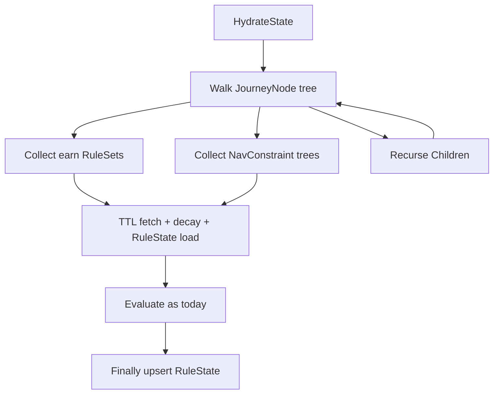
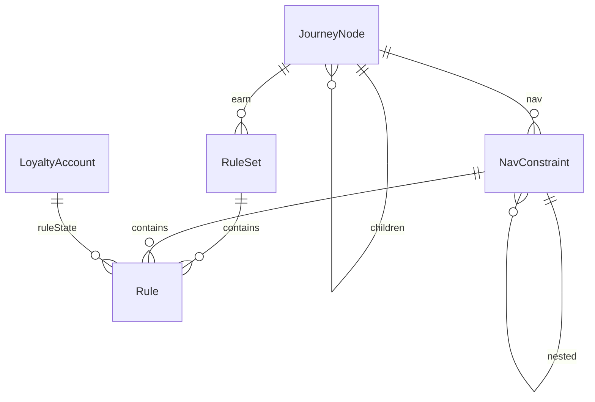

# Functional spec — `u1-tree-hydrate`

Behavioural source of truth for tree-wide hydrate. Technology-agnostic. No new HTTP route.

## Workflow

1. ProcessEvent reaches RulesService hydrate on a Live campaign (existing path).
2. Collect historical and taxonomic rules from every JourneyNode earn RuleSet, every NavConstraint tree (including nested composites), and recursively through Children. Do not read only root campaign journey RuleSets.
3. Run the existing TTL fetch, decay, LoyaltyAccount.RuleState load, then evaluate.
4. Finally upsert RuleState as today.
5. Empty Rules collections skip that node or constraint without failing the event.

## State machine

Hydrate does not invent account states. RuleState on the account is loaded and written as today; only the collect set grows.

Text: Walk the tree, collect earn and nav rules, then the existing hydrate pipeline.

## Entity relationship (derived)

## Rules summary (derived)

| ID | Statement |
|----|-----------|
| BR1.1 | Child earn RuleSets decay like root |
| BR1.2 | Nav trees including nested are collected |
| BR1.3 | Empty Rules does not throw |
| BR1.4 | Keep existing TTL / decay / upsert |
| BR1.5 | No EventService or ledger change |

## Scenarios

- Happy: second ProcessEvent on the same account applies TTL decay and loads RuleState for a child-node HistoricalRule (AC1.1.1).
- Nav: HistoricalRule on a nested NavConstraint is collected (AC1.1.2).
- Empty: empty Rules does not throw (AC1.1.2).
- Non-regression: existing root TTL tests stay green (AC1.1.3).
