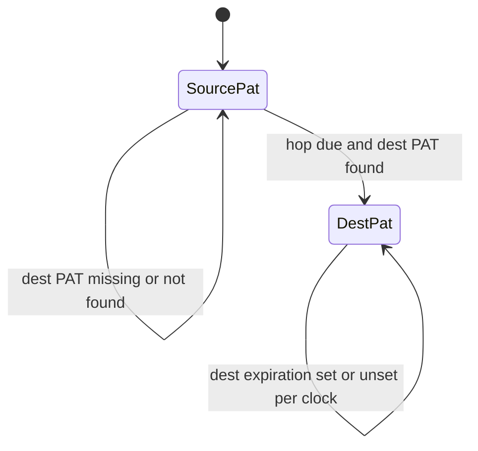
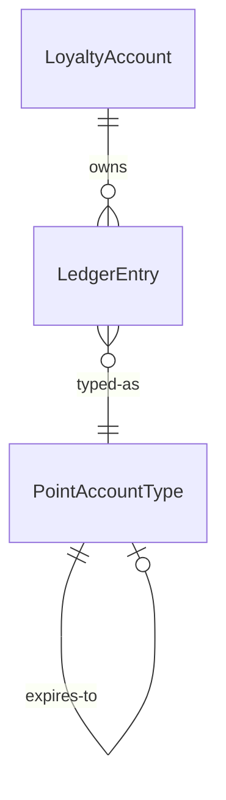

# Functional spec — `u2-earn-date-cascade`

Behavioural source of truth for earn-date dest clock. Confirmed Looks correct 2026-09-19. Human-gated ledger math. Implementation lives in SaveLedgerExpirations. U3 consume this hop; U3 must not invent a second clock.

## Workflow

1. A due LedgerEntry is evaluated for hop via dest ExpiresToPointAccountTypeId (bring-current in U3, or any existing caller of SaveLedgerExpirations).
2. Keep EarnDate on the moved row.
3. Set dest ExpirationDate: dest end-date if set; else EarnDate + dest days; else unset.
4. If dest days exist and EarnDate is missing, use existing ExpirationDate as last resort; never UtcNow as the lifespan base.
5. If dest PAT is missing or not found for the tenant: leave the row in source, log, continue.
6. If dest-PAT load/persist throws unexpectedly: fail ProcessEvent.
7. Rows already written with the old UtcNow dest clock stay until they hop again.

## State machine

Text: Source row hops to dest when due and dest PAT loads; otherwise it stays.

## Entity relationship (derived)

## Rules summary (derived)

| ID | Statement |
|----|-----------|
| BR2.1 | Keep EarnDate |
| BR2.2 | End-date wins |
| BR2.3 | Earn + dest days |
| BR2.4 | Neither → unset |
| BR2.5 | Last-resort existing expiration under dest days |
| BR2.6 | Missing dest stays in source |
| BR2.7 | Infra throw fails the event |
| BR2.8 | Old UtcNow rows stay |

## Scenarios

- Happy: EarnDate 2026-01-01, Escrow 30 expires-to Spendable 365 → dest ExpirationDate 2027-01-01 (AC2.1.1).
- End-date: dest end-date set → that instant (AC2.1.4).
- Neither: dest expiration unset (AC2.1.5).
- Missing dest: stay in source (AC2.1.3).
- Infra throw: event fails (AC2.1.6).
- History: already-cascaded UtcNow dates unchanged (AC2.1.2).
- Tests: arrange dest PAT with 365 days, not the 30-day Spendable factory.
