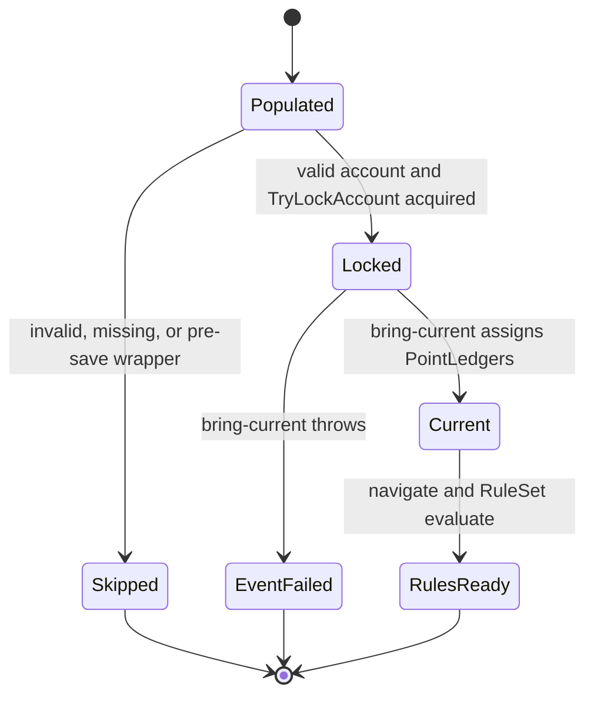
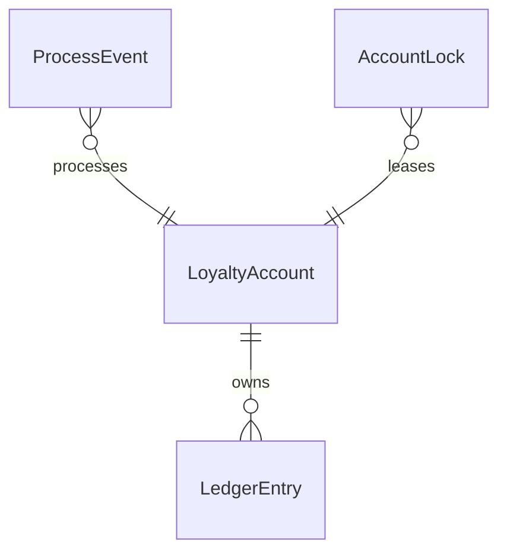

# Functional spec — `u3-expire-on-process`

Behavioural source of truth for expire-on-process under the existing lock. Confirmed Looks correct 2026-09-20. C1 owns the HTTP surface (no new routes). C2 owns dest clock. U3 owns only ProcessEvent order after populate.

## Workflow

1. ProcessEvent populates a loyalty account on the existing `POST /api/Events/{tenantId}/{modelName}/process` path.
2. If the account is invalid, missing, or a pre-save wrapper: skip bring-current. Do not invent a hosted sweep or `/points/expire`.
3. If the account is valid: acquire today's `TryLockAccount` (existing lease + retries). No new lock or queue.
4. After the lock: bring-current via existing expire of due ledgers (`ExpirationDate` due). Assign `loyaltyAccount.PointLedgers`.
5. Hops inside bring-current consume C2 only (U2 dest clock). U3 does not compute a second dest expiration.
6. Then navigate / RuleSet evaluate / award. This event can spend the released hold.
7. If bring-current throws after the lock: fail the whole ProcessEvent. Do not navigate or award that turn.
8. GET and reconcile bring-current callers stay as they are. `ExpirePoints` still locks when it finds due rows.

## State machine

Text: Valid accounts lock, then expire, then rules. Skip or fail-closed otherwise.

## Entity relationship (derived)

## Rules summary (derived)

| ID | Statement |
|----|-----------|
| BR3.1 | Lock then bring-current then rules |
| BR3.2 | Assign released PointLedgers |
| BR3.3 | Consume C2 dest clock |
| BR3.4 | Skip invalid / missing |
| BR3.5 | Skip pre-save wrapper |
| BR3.6 | Existing lock only |
| BR3.7 | Throw fails the event |
| BR3.8 | GET / reconcile unchanged |

## Scenarios

- Happy: due Escrow releases under the lock before this turn's rules; PointLedgers show the released hold (AC3.1.1).
- Contended: two ProcessEvents for the same account serialize on TryLockAccount (AC3.1.2).
- Scope: no new lock, queue, hosted sweep, or `/points/expire` (AC3.1.2).
- Throw: bring-current throw after the lock fails the event; no nav or award (AC3.1.3).
- Skip: invalid, missing, or pre-save wrapper accounts skip bring-current (AC3.1.3).
- GET/reconcile: callers unchanged this increment (AC3.1.2, FR3.6).
- Clock: dest hop math stays U2 / C2; EventService does not re-implement it.
