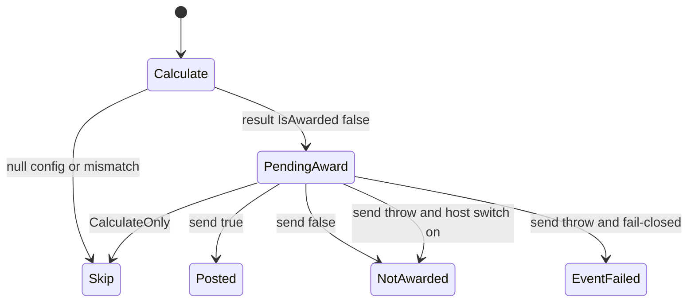
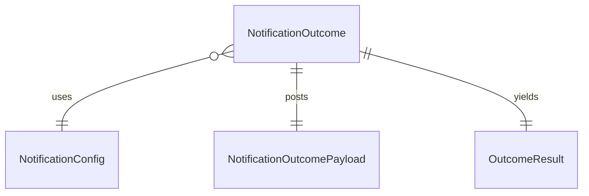

# Functional spec — `u4-notification-webhook`

Behavioural source of truth for NotificationOutcome webhook, MCP row, and docs increment-close. Confirmed Looks correct 2026-09-20. No new host, queue, or UX.

## Workflow

1. Live RuleSet is true. Calculate runs on NotificationOutcome.
2. Missing NotificationConfigId, missing/inactive config, or EventModelId mismatch → null. Event continues.
3. Happy Calculate returns a result with IsAwarded false. CalculateOnly stops here.
4. Host or EventService copies the notification port onto engine state (same copy style as the loyalty-account port). Do not add the port to the RulesService constructor.
5. Award calls send with tenantId, configId, and the closed payload. Existing rest_api adapter retries only.
6. Send true → IsAwarded true. Send false → IsAwarded false; siblings kept; reprocess may POST again.
7. Send throw → fail ProcessEvent unless the host switch is on (then same as send false).
8. Award loop records the returned IsAwarded. Award signature unchanged.
9. MCP matrix version 2026-09-18 adds the NotificationConfigId critical row.
10. Same change updates meaning docs and path-map (US5.1).

## State machine

Text: Calculate may skip. Award posts or records not-awarded. Throw fails the event unless the switch is on.

## Entity relationship (derived)

## Rules summary (derived)

| ID | Statement |
|----|-----------|
| BR4.1 | Config id required |
| BR4.2 | Missing / inactive / mismatch → null |
| BR4.3 | Closed tenant-scoped payload |
| BR4.4 | Send false keeps siblings |
| BR4.5 | Throw fails unless switch |
| BR4.6 | CalculateOnly does not send |
| BR4.7 | MCP 2026-09-18 row |
| BR4.8 | Always register the port |
| BR4.9 | Honor IsAwarded; signature unchanged |
| BR5.1 | Docs in the same change |

## Scenarios

- Happy POST of closed payload, this tenant only (AC4.1.1).
- Calculate null paths (AC4.1.2).
- Send false / honor IsAwarded (AC4.1.3, AC4.1.9).
- Throw fail-closed vs host switch (AC4.1.4, AC4.1.7).
- CalculateOnly (AC4.1.5).
- MCP row; do not retarget 2026-06-20 fixtures (AC4.1.6).
- Port resolves when DataLake is disabled (AC4.1.8).
- Docs/graph increment-close (AC5.1.1–AC5.1.3).
