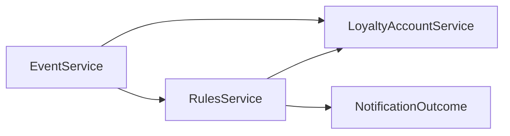

# Components — MVP engine closeout

Brownfield catalogue of **existing** Core/DTO/Notification blocks this increment touches. No new capability ids, host, AWS, or UI. Sources: `requirements.md`, `stories.md`, CodeKB `architecture.md` / `component-inventory.md`, `team-practices`.

```yaml
components:
  - name: EventService
    summary: Tenant-scoped ProcessEvent host — populate, lock, then rules
    behaviour: >
      After a valid loyalty account is populated, ProcessCampaignsAsync acquires
      today's TryLockAccount (lease + retries) and must bring points current
      before navigation and RuleSet evaluate. Invalid, missing, or pre-save
      wrapper accounts skip bring-current. A throw after the lock fails the
      whole event. No new lock, queue, hosted sweep, or /points/expire.
      GET/reconcile callers stay unchanged. Do not revive MassTransit
      process-event publish.
    responsibilities:
      - Own ProcessEventInternalAsync / ProcessCampaignsAsync order
      - Acquire the existing account lock before rules
      - Call bring-current then RulesService on the same path
    depends_on:
      - component: LoyaltyAccountService
        interaction: populate, TryLockAccount, bring-current / PointLedgers
        style: sync
      - component: RulesService
        interaction: hydrate, navigate, evaluate, award after the lock
        style: sync
    dependents: []
    external_dependencies: []
    entities: []

  - name: LoyaltyAccountService
    summary: Account, ledgers, expire-on-process, earn-date cascade
    behaviour: >
      BringLoyaltyAccountPointsCurrentInternalAsync expires ExpirationDate <= UtcNow
      and assigns PointLedgers (assumes already locked on ProcessEvent).
      SaveLedgerExpirations keeps EarnDate and sets dest expiration from dest
      end-date, else EarnDate + days, else unset. Missing dest PAT stays in
      source and does not fail the event; unexpected dest-PAT infra throws fail
      ProcessEvent. Already-cascaded UtcNow dest dates stay until the next hop.
      Ledger date math is human-gated. Do not redesign PointLedgerTypeStrings.
    responsibilities:
      - Own TryLockAccount and bring-current
      - Own SaveLedgerExpirations earn-date math
      - Own LoyaltyAccount, LedgerEntry, and PointAccountType shape used on hops
    depends_on: []
    dependents:
      - component: EventService
        interaction: lock and bring-current on ProcessEvent
      - component: RulesService
        interaction: RuleState load/upsert and PointBalance after ledgers are current
    external_dependencies:
      - name: Existing DAL / Backend persist
        kind: database
        purpose: Load and write accounts, ledgers, and PAT rows (tenant-scoped)
    entities:
      - name: LoyaltyAccount
        identifier: id
        attributes: [id, tenantId, PointLedgers, RuleState]
        references: []
      - name: LedgerEntry
        identifier: id
        attributes: [id, EarnDate, ExpirationDate, PointAccountTypeId]
        references: []
      - name: PointAccountType
        identifier: id
        attributes: [id, PointsLifespanDays, PointsLifespanEndDate, ExpiresToPointAccountTypeId]
        references: []

  - name: RulesService
    summary: Hydrate the journey tree, navigate, evaluate, honor IsAwarded
    behaviour: >
      HydrateState must collect historical and taxonomic rules from every
      journey node's earn RuleSets and NavConstraint trees (including nested
      composites and Children), not only root campaign.Journey.Rules.
      Existing TTL fetch, decay, LoyaltyAccount.RuleState load, and finally
      upsert stay. Award loop must honor returned IsAwarded false and must
      not change AwardOutcomeAsync signature. Sets RulesEngineState.NotificationService
      the same way as LoyaltyAccountService. CalculateOnly skips Award/send.
    responsibilities:
      - Own HydrateState / tree collect
      - Own ProcessJourneyAsync award loop
      - Own JourneyNode collect helpers used by hydrate
    depends_on:
      - component: LoyaltyAccountService
        interaction: RuleState and PointLedgers after bring-current
        style: sync
      - component: NotificationOutcome
        interaction: Calculate then Award when a Live RuleSet earns the Kind
        style: sync
    dependents:
      - component: EventService
        interaction: process rules after lock and bring-current
    external_dependencies: []
    entities:
      - name: JourneyNode
        identifier: id
        attributes: [id, Rules, NavConstraint, Children]
        references: []
      - name: RuleSet
        identifier: id
        attributes: [id, Rules, Outcomes]
        references: []
      - name: HistoricalRule
        identifier: id
        attributes: [id, ttl]
        references:
          - entity: LoyaltyAccount
            owned_by: LoyaltyAccountService
            relationship: RuleState keyed per account
      - name: TaxonomicRule
        identifier: id
        attributes: [id]
        references:
          - entity: LoyaltyAccount
            owned_by: LoyaltyAccountService
            relationship: RuleState keyed per account

  - name: NotificationOutcome
    summary: Existing Kind that POSTs the tenant rest_api webhook
    behaviour: >
      NotificationConfigId is required for Calculate to return a result.
      Missing, inactive, or EventModelId-mismatch config yields null (event
      continues). Award sends closed NotificationOutcomePayload via
      INotificationService on RulesEngineState. false send leaves IsAwarded
      false; siblings stay; reprocess may POST again. Throw fails ProcessEvent
      unless the host switch is on. Always register INotificationService
      (remove DisableDataLake gate). No new Kind, no Award signature change,
      no email/Twilio adapters, no new Notification component split.
    responsibilities:
      - Own Calculate/Award for the existing Notification Kind
      - Own closed NotificationOutcomePayload in Journeys.DTO
      - Use existing INotificationService and rest_api adapter
    depends_on: []
    dependents:
      - component: RulesService
        interaction: evaluate and award on a true Live RuleSet
    external_dependencies:
      - name: INotificationService / RestApiAdapter
        kind: third-party-api
        purpose: POST tenant rest_api webhook with the closed payload
    entities:
      - name: NotificationOutcomeConfig
        identifier: NotificationConfigId
        attributes: [NotificationConfigId, Kind]
        references: []
      - name: NotificationOutcomePayload
        identifier: eventId
        attributes: [tenantId, loyaltyAccountId, extAccountId, campaignId, ruleSetId, issuingOutcomeId, issuingOutcomeKind, eventId, eventType, eventModelId, awardedAtUtc]
        references:
          - entity: LoyaltyAccount
            owned_by: LoyaltyAccountService
            relationship: payload names the account that earned the outcome
```

## Component Diagram



Text: EventService calls LoyaltyAccountService (lock, bring-current) and RulesService (hydrate/evaluate/award). RulesService calls LoyaltyAccountService (RuleState, balances) and NotificationOutcome (Calculate/Award). NotificationOutcome sends through existing INotificationService / RestApiAdapter.

## Component Summary

| Component | Purpose | Depends On | Dependents | Entities Owned |
|-----------|---------|------------|------------|----------------|
| EventService | ProcessEvent lock then rules | LoyaltyAccountService, RulesService | — | — |
| LoyaltyAccountService | Bring-current and earn-date cascade | — | EventService, RulesService | LoyaltyAccount, LedgerEntry, PointAccountType |
| RulesService | Tree hydrate, evaluate, honor IsAwarded | LoyaltyAccountService, NotificationOutcome | EventService | JourneyNode, RuleSet, HistoricalRule, TaxonomicRule |
| NotificationOutcome | Existing Kind webhook POST | — | RulesService | NotificationOutcomeConfig, NotificationOutcomePayload |

## Entity Ownership

| Entity | Owning Component | Identifier | Attributes | References |
|--------|------------------|------------|------------|------------|
| LoyaltyAccount | LoyaltyAccountService | id | id, tenantId, PointLedgers, RuleState | — |
| LedgerEntry | LoyaltyAccountService | id | id, EarnDate, ExpirationDate, PointAccountTypeId | PointAccountType |
| PointAccountType | LoyaltyAccountService | id | id, PointsLifespanDays, PointsLifespanEndDate, ExpiresToPointAccountTypeId | — |
| JourneyNode | RulesService | id | id, Rules, NavConstraint, Children | — |
| RuleSet | RulesService | id | id, Rules, Outcomes | — |
| HistoricalRule | RulesService | id | id, ttl | LoyaltyAccount |
| TaxonomicRule | RulesService | id | id | LoyaltyAccount |
| NotificationOutcomeConfig | NotificationOutcome | NotificationConfigId | NotificationConfigId, Kind | — |
| NotificationOutcomePayload | NotificationOutcome | eventId | closed FR4.5 field list | LoyaltyAccount |

## External Dependencies

| Component | Dependency | Kind | Purpose |
|-----------|------------|------|---------|
| LoyaltyAccountService | Existing DAL / Backend persist | database | Tenant-scoped account and ledger I/O |
| NotificationOutcome | INotificationService / RestApiAdapter | third-party-api | Tenant webhook POST |

## Rationale

| Component | Why it is a separate building block |
|-----------|-------------------------------------|
| EventService | Distinct lifecycle — the ProcessEvent lock/order seam (US3.1). Does not own date math or hydrate. |
| LoyaltyAccountService | Distinct data ownership — ledgers and PAT hops (US2.1, US3.1). Human-gated money-like. |
| RulesService | Distinct concern — tree collect and award loop (US1.1, FR4.10). JourneyNode is an entity here, not a fifth component. |
| NotificationOutcome | Distinct Kind already in the engine (US4.1). Adapter stays external; do not split Journeys.Notification into a new component. |

**Alternatives rejected:** A new Notification component (Q2-B) and a ProcessEvent HTTP/MCP component (Q2-C) — those are existing host/adapter surfaces, not new building blocks. A new async hop (Q3-B) would reopen MassTransit process-event publish, which is out of increment.

**Single viable decomposition:** Existing onion blocks only (Q1-A / Q2-A). No new component is warranted.
