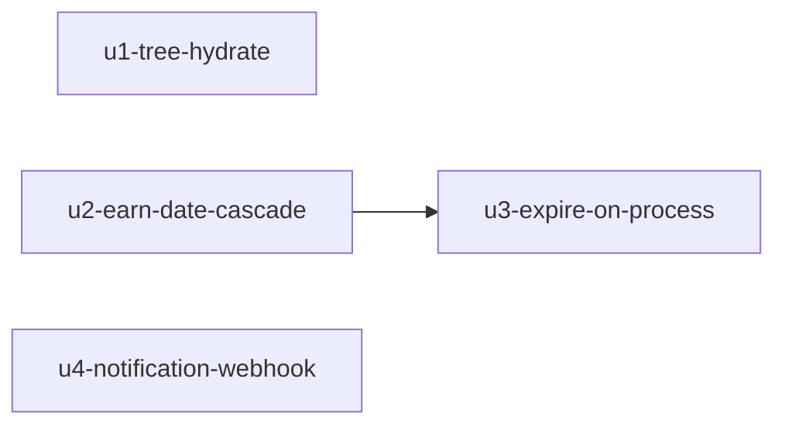

# Unit dependency DAG — MVP engine closeout

Topology only. Delivery Planning chooses Bolt sequence. No recommended build order here.

```yaml
units:
  - name: u1-tree-hydrate
    kind: library
    depends_on: []
  - name: u2-earn-date-cascade
    kind: library
    depends_on: []
  - name: u3-expire-on-process
    kind: library
    depends_on:
      - u2-earn-date-cascade
  - name: u4-notification-webhook
    kind: library
    depends_on: []
```

## Edges

| Unit | Depends on | Why |
|------|------------|-----|
| `u1-tree-hydrate` | — | Collect/hydrate does not need ledger math |
| `u2-earn-date-cascade` | — | Clock lives in `SaveLedgerExpirations` |
| `u3-expire-on-process` | `u2-earn-date-cascade` | Bring-current hops must use earn-date dest expiration |
| `u4-notification-webhook` | — | Webhook and docs do not need PAT math; docs ride this unit |

## Integration points

| From | To | Style | What crosses |
|------|----|-------|--------------|
| U3 | U2 | in-process sync | Bring-current calls cascade hops on due rows |
| U3 | U1 / U4 | in-process sync | Same ProcessEvent path after lock — not a unit edge (no compile/type dependency) |

No new APIs, queues, or events between units. Shared types are existing Core/DTO.

## Parallel sets

These sets have no edge between members (multiple valid topological orderings exist):

- `{ u1-tree-hydrate, u2-earn-date-cascade, u4-notification-webhook }`
- `{ u1-tree-hydrate, u4-notification-webhook }` may proceed without waiting on U2/U3

U3 cannot start until U2’s dest-clock contract exists.

## Diagram



Text: Only expire-on-process depends on earn-date cascade. Hydrate and webhook are independent.
